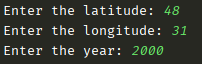
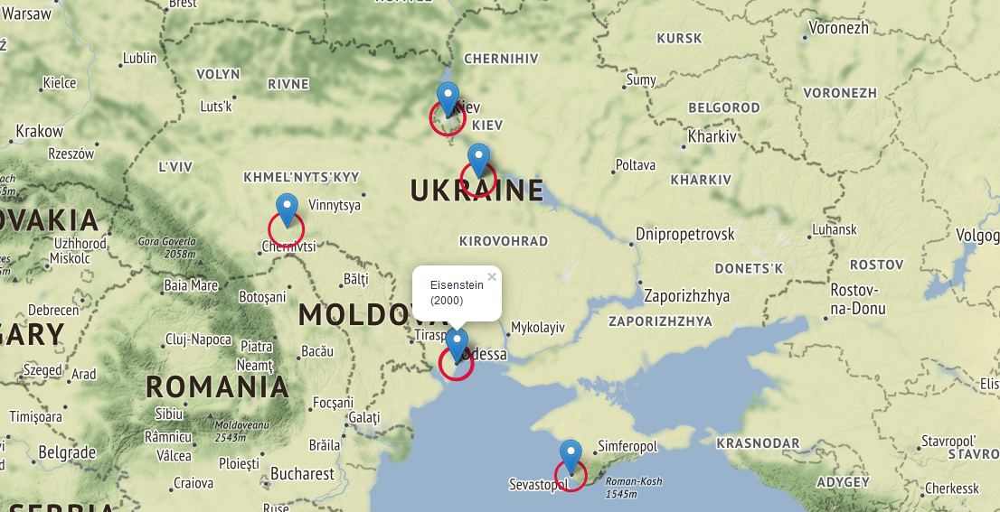

#Movies Map

On the map are displayed ten closest film-shooting places to the place that is inputted in the given year.

Markers on the map contains the name of the movie and the shooting year.

##Example of usage

